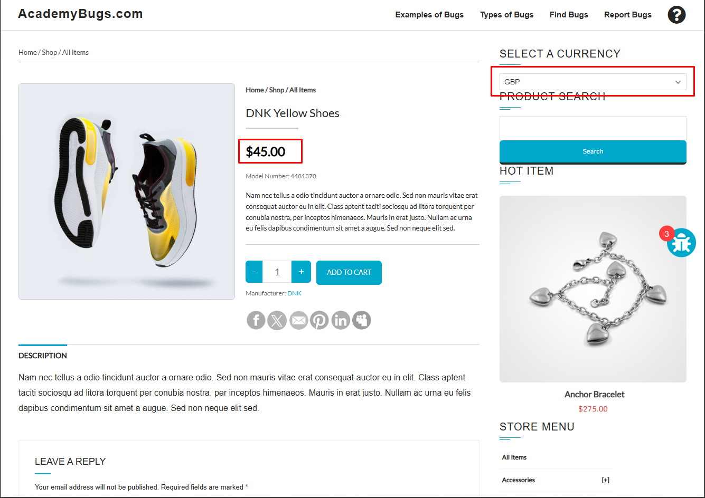

## Bugs Funcionais

**[1º BUG] - Botão de compartilhamento no "X" não está funciondo corretamente**

**Issue Type:** Funcional \
**Prioridade:** Média \
**Frequência:** Sempre \
**Environment:** Todos os navegadores

**Reprodução do Bug:**
- Abra https://academybugs.com
-  Ache a aba "Find Bugs" na barra de navegação
- Clique em um produto
- Na página do produto, clique no ícone do X

**Resultado esperado:** O ícone de compartilhamento do X, deveria redirecionar o usuário para o X 

**Resultado encotrado:** O ícone de compartilhamento do X está redirecionando para uma página quebrada

**[2º BUG] Câmbio de moedas não está funcionando** \

**Issue Type:** Funcional \
**Prioridade:** Alta \
**Frequência:** Sempre com todas as moedas \
**Environment:** Todos os navegadores

