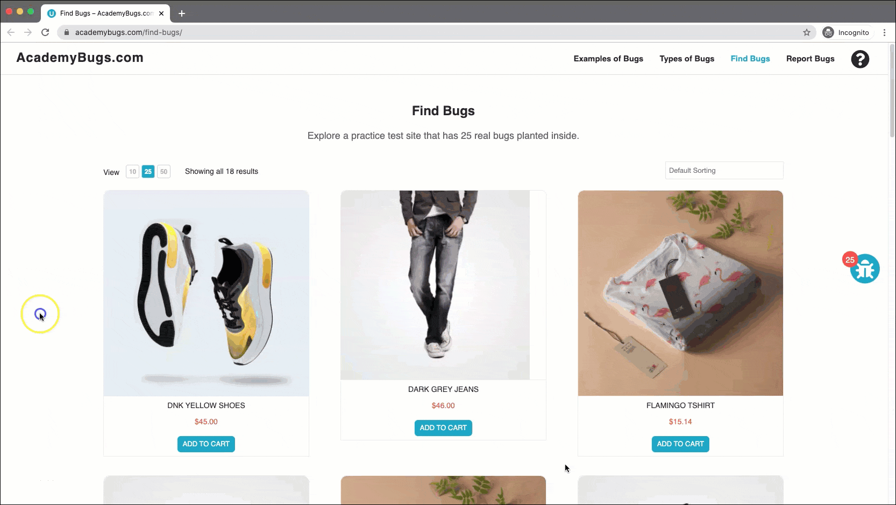
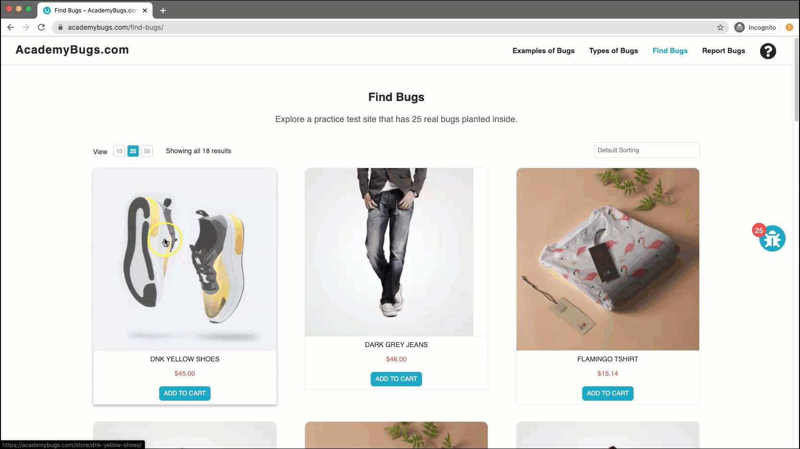
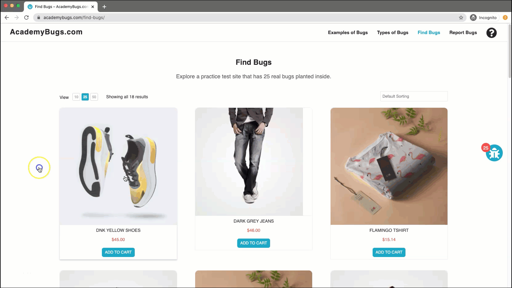

## 🛠️ Bugs Funcionais

**[1º BUG] - Botão de compartilhamento no "X" não está funcionando corretamente**

**Issue Type:** Funcional \
**Prioridade:** Média \
**Frequência:** Sempre \
**Environment:** Todos os navegadores

**Reprodução do Bug:**
- Abra https://academybugs.com
-  Ache a aba "Find Bugs" na barra de navegação
- Clique em um produto
- Na página do produto, clique no ícone do X

**Resultado esperado:** O ícone de compartilhamento do X, deveria redirecionar o usuário para o X 

**Resultado encotrado:** O ícone de compartilhamento do X está redirecionando para uma página quebrada

**[2º BUG] Câmbio de moedas não está funcionando** 

**Issue Type:** Funcional \
**Prioridade:** Alta \
**Frequência:** Sempre com todas as moedas \
**Environment:** Todos os navegadores

**Reprodução do Bug:**
- Abra https://academybugs.com
- Ache a aba "Find Bugs" na barra de navegação
- Clique em um produto
- Clique no menu dropdown de "Select a Currency"
- Troque a moeda

**Resultado esperado:** O usuário pode trocar de moeda normalmente quando clicar na aba de "Select a currency"

**Resultado encontrado:** A moeda não é alterada quando clicado em "Select a currency"

**[3º BUG] - Manufacturer 404 error** \
**Issue Type:** Funcional \
**Prioridade:** Média \
**Frequência:** Sempre \
**Environment:** Todo os navegadores

**Reprodução do Bug:**
- Abra https://academybugs.com
- Ache a aba "Find Bugs" na barra de navegação
- Selecione um produto
- Clique no link do "Manufacturer" em baixo dqa quantidade

**Resultado esperado:** Ao clicar no link, o usuário deveria ser levado para a página do fabricante

**Resultado encontrado:** Ao clicar no link, abre uma página quebrada

**[4º BUG] - Não é possível colocar mais de 3 produtos iguais no carrinho**

**Issue Type:** Funcional \
**Prioridade:** Alta \
**Frequência:** Sempre \
**Environment:** Todos os navegadores

Reprodução do Bug:
- Abra https://academybugs.com 
- Ache a aba "Find Bugs" na barra de navegação
- Selecione um produto
- Adicione um produto no carrinho
- No carrinho, adicione mais de 3 produtos iguais clicando no "+" e depois em "update"

**Resultado esperado:** A quantidade de produtos pode ser maior do que 2

**Resultado encontrado:** Quando clicado em "update" a quantidade do produto volta para 2

**[ 5º BUG] - Preço maior no valor total da compra** \
**Issue Type:** Funcional \
**Prioridade:** Alta \
**Frequência:** Sempre \
**Environment:** Todos os navegadores

**Reprodução do Bug:**
- Abra https://academybugs.com
- Ache a aba "Find Bugs" na barra de navegação
- Selecione um produto
- Adicione ao carrinho
- Vá até a página do carrinho
- Em "Cart Totals" é encontrado o bug

**Resultado esperado:** O valor total do pedido deve ser igual ao valor dos produtos selecionados pelo o usuário

**Resultado encontrado:** o valor total é $100 maior do que o valor do carrinho

## 🖥️ Bugs Visuais

**[6º BUG] - Imagem da "Dark Grey Jeans"** \
Issue Type: Visual \
Prioridade: Média  \
Frequência: Sempre\
Environment: Todos os navegadores

Reprodução do Bug:
- Abra https://academybugs.com
- Ache a aba "Find Bugs" na barra de navegação
- Clique no produto "Dark Grey Jeans"

**Resultado esperado:** A imagem deveria preencher todo o card como em todos os outros produtos da loja.

**Resultado encontrado:** A imagem não está preenchendo totalmente o card.

**[7º BUG] - Botão "Sign In" no local errado** \
Issue Type: Visual \
Prioridade: Baixa \
Frequência: Sempre \
Environment: Todos os navegadores

Reprodução do Bug:
- Abra https://academybugs.com
- Ache a aba "Find Bugs" na barra de navegação
- Selecione um produto
- Desça até o final da página
- Localize o botão "Sign In" no canto inferior direito

**Resultado esperado:** Campo de Login com respiro na página, respeitando o espaçamento predefinido

**Resultado encontrado:** O botão "Sign In" está invadindo o footer da página  

## 📝 Bugs de Conteúdo

## ❌ Bugs de Performance
